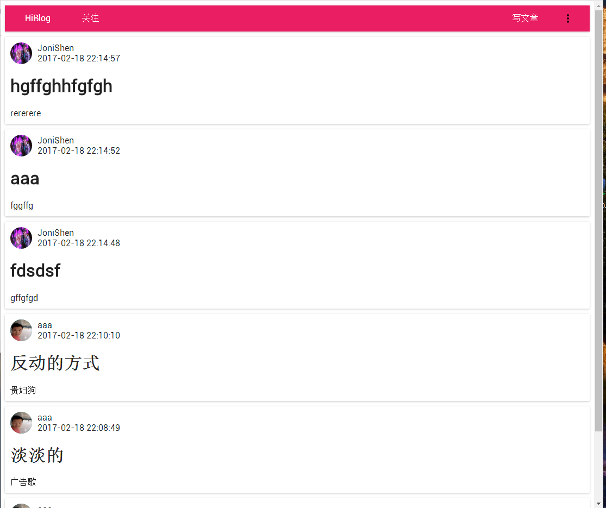
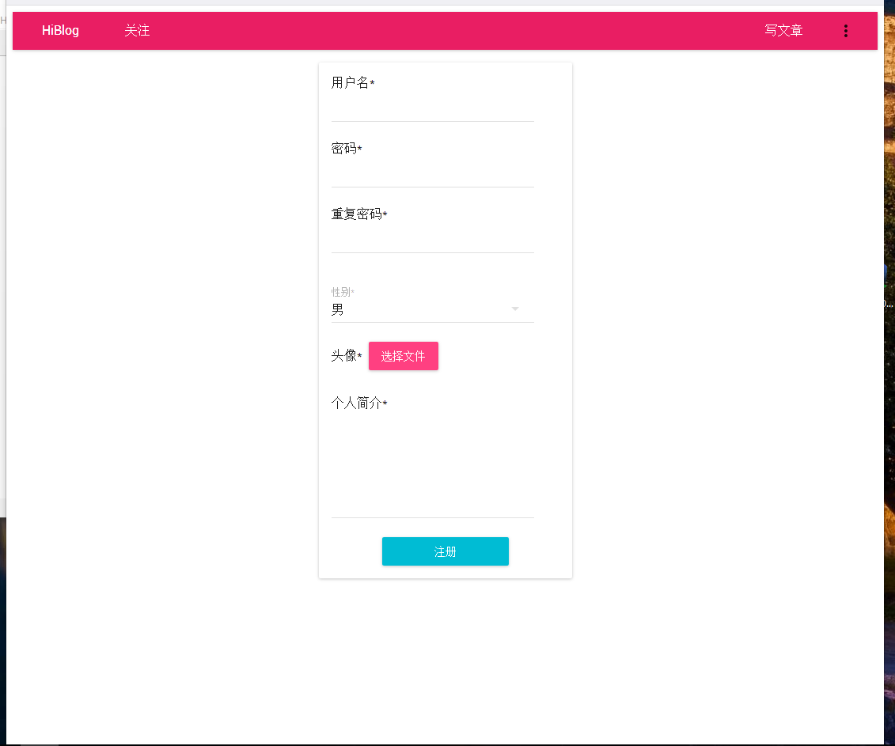
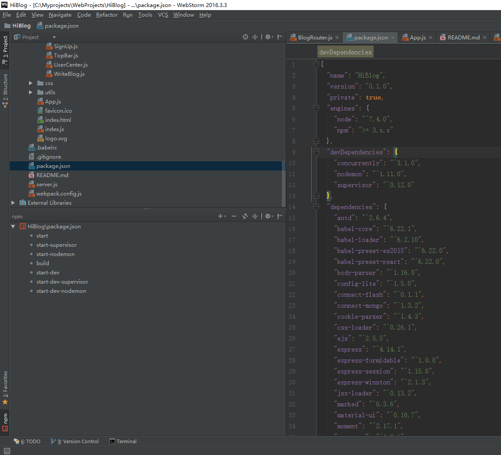

用到的技术：React Node Webpack  material-ui mongo

github地址：https://github.com/shenjiajun53/HiBlog
喜欢请给个star！！！
推荐两个工具：https://app.astralapp.com/dashboard  这个网站可以用来管理github上的star

另一个叫 Octotree  是Chrome应用，可以看到github上的项目结构，跟IDE一样

我是一名Android开发，虽然在互联网公司，但是感觉自己的工作根本就是软件行业的工作。
想想对服务端，前端都不了解真是挺无知的。
之前看同事有自己的博客站，百度了下，发现要做那种个人网站真是很简单，只不过那根本就是个静态网站，太辣鸡，所以我决定自己撸个博客网站。


主页




注册页




## 下面就是技术选型啦：
### 前端：
要用就用潮的，三个著名框架Angular，React，Vue
Angular听说1和2完全不兼容，最讨厌这种对开发人员不负责的框架了，不考虑
Vue的语法更像常规的前端开发，React默认支持es6，风格跟Android更像，尤其跟Android的DataBinding很像。
另一方面es6很像Java，我肯定使用es6开发的，我更喜欢面向对象。Vue当然也可以用es6，但我懒得鼓捣了，更重要的ReactNative可比Weex火多了。哈哈，所以前端我就选择React了。
真正的前端开发应该更喜欢Vue吧，文档都有中文的。

### 后端：
虽然我是做Android的，但是遥想两年前第一次接触JavaEE的时候真是被恶心到了，不考虑
python没有花括号，知乎上都嘲笑写python要用游标卡尺，不考虑
PHP开发比Java更快，而且现在快跟Java平分秋色了吧，可以考虑。
Node技术还是挺新的，各种文章资料会比较少，坑也可能比较多。但我真是不高兴再学一门语言了，所以哈哈，就选Node了。

## 运行
1.git clone

2.安装mongo，然后在安装目录下新建文件夹，比如“D:\data\db”，然后打开“D:\MongoDB\Server\3.4\bin\mongod.exe”开启服务，会有个命令行窗口保持运行

3.建议安装一个mongo可视化工具，Robomongo，默认连接localhost：27017，能连接上就说明好了

4.进入项目目录下，执行命令
```
npm install
```
安装相关依赖库

5.执行
```
node server.js
```
开启服务。
或者，比如我用的Webstorm，可以点击左下角npm按钮，点击start-dev-serpervisor或者点击start-dev-nodemon,都可以



6.打开浏览器，输入 localhost:5006


## 下面开始：
我对前后端几乎零基础，之前有看过ReactNative，顺便看了下React。
所以写的代码在内行眼里可能很丢人，哈哈

### 第一步：
安装node，新建个文件夹，HiBlog
命令行：

```
cd HiBlog
```
初始化：
```
npm init
```
生成package.json文件
然后安装各种需要的包，比如express--node框架，webpack--打包工具
```
npm i express  --save;npm i webpack --save
```
然后这两个就下载好了，在node_module文件夹下，引用也自动添加到package.json文件里了
或者package.json文件直接复制的别人的，里面有内容了，
```
npm i
```
把package里所有引用都下载到node_module下。
跟Android的依赖很像啊

我的module引用
```
{
  "name": "HiBlog",
  "version": "0.1.0",
  "private": true,
  "engines": {
    "node": "^7.4.0",
    "npm": ">= 3.x.x"
  },
  "devDependencies": {
    "concurrently": "^3.1.0",
    "nodemon": "^1.11.0",                                     //node监听工具，改动代码自动重启服务
    "supervisor": "^0.12.0",                                   //跟上面一样的，用一个就行，反正我都加了
  },
  "dependencies": {
    "antd": "^2.6.4",                                         //蚂蚁金服的UI框架，项目里没用，哈哈
    "babel-core": "^6.22.1",
    "babel-loader": "^6.2.10",
    "babel-preset-es2015": "^6.22.0",
    "babel-preset-react": "^6.22.0",
    "body-parser": "^1.16.0",
    "config-lite": "^1.5.0",
    "connect-flash": "^0.1.1",
    "connect-mongo": "^1.3.2",
    "cookie-parser": "^1.4.3",
    "css-loader": "^0.26.1",
    "ejs": "^2.5.5",
    "express": "^4.14.1",
    "express-formidable": "^1.0.0",
    "express-session": "^1.15.0",
    "express-winston": "^2.1.3",
    "jsx-loader": "^0.13.2",
    "marked": "^0.3.6",
    "material-ui": "^0.16.7",                                      //UI框架，项目里主要用的就是这个
    "moment": "^2.17.1",
    "mongoose": "^4.8.1",                                     //数据库框架
    "multer": "^1.3.0",
    "objectid-to-timestamp": "^1.3.0",
    "react": "^15.4.2",
    "react-dom": "^15.4.2",
    "react-router": "^3.0.2",
    "react-tap-event-plugin": "^2.0.1",
    "roboto": "^0.8.2",
    "sha1": "^1.1.1",
    "style-loader": "^0.13.1",
    "webpack": "^1.14.0",
    "winston": "^2.3.1"
  },
  "scripts": {
    "start": "node server.js",                                          //启动服务
    "start-supervisor": "supervisor --harmony server",        //启动服务    代码有变动就重启
    "start-nodemon": "nodemon server.js",                    //启动服务       代码有变动就重启
    "build": "webpack --watch",                                   //打包React代码， --watch代表代码有变动就重新打包
    "start-dev": "concurrently \"npm run start\" \"npm run build\"",
    "start-dev-supervisor": "concurrently \"npm run start-supervisor\" \"npm run build\"",
    "start-dev-nodemon": "concurrently \"npm run start-nodemon\" \"npm run build\""
  }
}
```

看下我的目录结构


看下我的github页面，右边就是我在最上面介绍的github插件，工欲善其事必先利其器。

新建文件webpack.config.js，webpack工具会识别到这个文件里的脚本，然后把React代码打包，很重要，不然不管是React的JSX或者ES6，浏览器都读不懂。

新建文件夹views，里面是前端代码
新建文件夹routes，里面放路由代码，因为我们用的React，所以这个网站就是所谓的单页网站，One Page Website。看views下面只有一个index.html。
这个HTML就是个空壳，真正的网页都是有js代码生成的，不管是哪个页面，都依托这个HTML。所以这里和常规网页不通，网页不是由服务器渲染的一个个HTML。网站的工作方式更像APP，通过api实现网页内容变动。前后端分离才是人性化的开发方式，不是吗？

文件夹config，里面放一些设置

最重要的server.js
```
/**
 * Created by shenjj on 2017/1/23.
 */
let express = require('express');
let app = express();
let path = require('path');
let ejs = require('ejs');
let bodyParser = require("body-parser");
let MongoUtil = require("./server/lib/MongoUtil");
let session = require('express-session');
let MongoStore = require('connect-mongo')(session);
let cookieParser=require("cookie-parser");
let config = require('config-lite');
let flash = require('connect-flash');

let homeRouter = require('./routes/HomePageRouter');
let userRouter = require('./routes/userInfo');
// let signRouter = require("./server/signUp").signUp;
// let DealSignUp = require("./server/DealSignUp");
let RouterManager = require("./routes/RouterManager");

// 设置模板目录
app.set('views', './views');

// 设置模板引擎为 ejs
app.set('view engine', 'html');
app.engine('html', ejs.renderFile);

// app.use配置
app.use('/output', express.static(path.join(__dirname, '/output')));
//app.use('/views', express.static(path.join(__dirname, '/views')));
app.use('/uploadFiles', express.static(path.join(__dirname, '/uploadFiles')));

...
...

app.use(bodyParser.json());
app.use(bodyParser.urlencoded({extended: true}));

// app.use('/', homeRouter);
app.use('/users', userRouter);

let routerManager = new RouterManager(app);
routerManager.startRouters();


app.get('*', function (request, response) {
    response.sendFile(path.resolve(__dirname, 'views', 'index.html'))
});

app.listen(process.env.PORT || 5006);

console.log("url=" + process.env.PORT);
```
这里开始就是真的node代码里
设置模版目录在views下面，其实就是那个index.html
这是模版引擎ejs，用来渲染成html，（有两个主流引擎ejs和jade，ejs和html一毛一样，所以我推荐这个，jade虽然省代码，但是跟python一样，太随便了）
另外我不需要用ejs的功能，所以我直接设置成HTML了。

app.use('/output', express.static(path.join(__dirname, '/output')));
app.use('/uploadFiles', express.static(path.join(__dirname, '/uploadFiles')));
用来指定打包后的js代码，在output目录下，这个是在wenpack.config里设置的
uploadFiles是js代码里引用的图片，空目录，里面的图片是用户上传的。


RouterManager是我写的Router管理类，从风格也能看出我就是比较习惯Java，还是面向对象舒服，虽然代码量大一点。
routerManater把app传进去

最后是端口号，默认5006


RouterManager里：
```
...
        this.app.use("/", new HomePageRouter().getRouter());
        this.app.use("/api", new UserRouter().getRouter());
        this.app.use("/api", new BlogRouter().getRouter());
...
```

HomePageRouter里：
```
        router.get('/', function (req, res) {
            console.log("homepage on render");
            res.render('index');
            // res.render('');
            // res.redirect("/SignUp");
        });
```

所以就是，直接在浏览器输入localhost:5006，会跳转到主页
如果输入localhost:5006/api/xxx，会调起userRouter或者blogRouter里的接口，看那个匹配了

## 下面是部分前端代码
```
class App extends React.Component {
    constructor(props) {
        super(props);
        this.state = {
            hasLogin: false,
            user: null
        }
    }

    componentWillMount() {
        let url = "/api/getUserInfo";
        fetch(url, {
            method: "post",
            credentials: 'include'     //很重要，设置session,cookie可用
        }).then(
            (response) => {
                return response.json();
            }
        ).then(
            (json) => {
                console.log(JSON.stringify(json));
                if (json.result) {
                    this.setState({
                        hasLogin: json.result.hasLogin,
                        user: json.result.user
                    });
                }
                // console.log("state=" + this.state.hasLogin);
            }
        ).catch(
            (ex) => {
                console.error('parsing failed', ex);
            });
    }

    render() {
        console.log('app render');
        // console.log('chileren=' + this.props.children.name);
        return (
            <MuiThemeProvider>
                <div>

                    <TopBar hasLogin={this.state.hasLogin} user={this.state.user}/>
                    {React.cloneElement(this.props.children, {user: this.state.user})}
                </div>
            </MuiThemeProvider>
        );
    }
}

render(
    <Router history={browserHistory}>
        <Route path="/" component={App}>
            <IndexRoute component={Home}/>
            <Route path="SignUp" component={SignUp}/>
            <Route path="SignIn" component={SignIn}/>
            <Route path="UserCenter" component={UserCenter}/>
            <Route path="MyFollow" component={MyFollow}/>
            <Route path="WriteBlog" component={WriteBlog}/>
            <Route path="BlogDetail/:blogId" component={BlogDetail}/>
            <Route path="Settings" component={Settings}/>
            <Route path="Favorites" component={Favorites}/>
            <Route path="MyBlogs" component={MyBlogs}/>
        </Route>
    </Router>
    ,
    document.getElementById('root')
)
```
页面跳转完全由前端控制，用Rooter类，APP是整个网页的父布局。在APP渲染完成后获取user信息，this.props.children是当前页面，可以clone一个ReactComponent，并设置props。